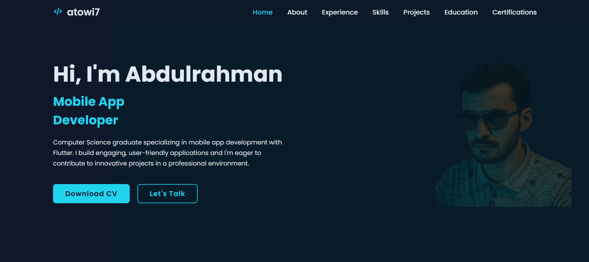

# Personal Portfolio Website

This is the repository for my personal portfolio website, designed to showcase my skills, projects, and experience as a Mobile App Developer.

**Live Demo:** [https://atowi7.com](https://atowi7.com)

 

## About The Project

This portfolio is a responsive, single-page application built with modern web technologies. The goal was to create a clean, professional, and visually appealing platform to present my work to potential employers and collaborators. The design is mobile-first, ensuring a seamless experience across all devices.

## Features

-   **Responsive Design:** Adapts to all screen sizes, from mobile phones to desktop monitors.
-   **Smooth Scroll Animations:** Elements elegantly fade into view on scroll, powered by the performant `IntersectionObserver` API.
-   **Interactive UI:** Modern and clean user interface with hover effects and interactive project cards.
-   **Project Showcase:** A grid-based gallery to display my latest projects with links to their GitHub repositories.
-   **Dynamic Navigation:** The navigation bar indicates the currently active section and is sticky for easy access.
-   **Timeline View:** A clear and concise timeline for my educational and professional experience.

## Tech Stack

This project was built using the following technologies:

-   **HTML5:** For the structure and content of the website.
-   **CSS3:** For styling, layout (Flexbox/Grid), animations, and responsiveness.
--   **JavaScript (ES6+):** For interactivity, DOM manipulation, and handling scroll events with the `IntersectionObserver` API.

## Getting Started

To get a local copy up and running, follow these simple steps.

### Prerequisites

You only need a modern web browser.

### Installation

1.  Clone the repository:
    ```sh
    git clone [https://github.com/atowi7/Portfolio.git](https://github.com/atowi7/Portfolio.git)
    ```
2.  Navigate to the project directory:
    ```sh
    cd Portfolio
    ```
3.  Open the `index.html` file in your browser to view the website.

## Contact

Abdulrahman Atowi
-   **LinkedIn:** [https://www.linkedin.com/in/atowi7](https://www.linkedin.com/in/atowi7)
-   **Email:** `dhoom.sedge@gmail.com`